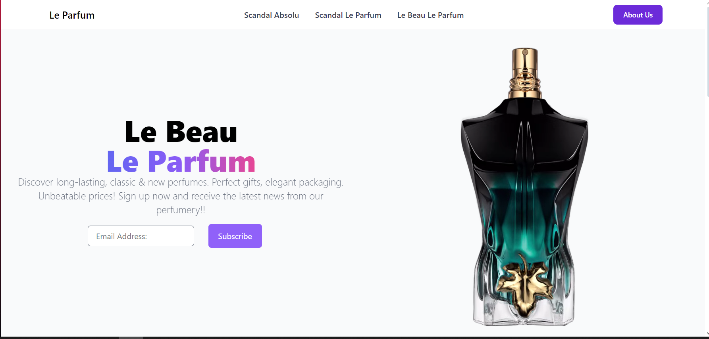

# Le Parfum - Website

## Descrição

Este é o repositório do site Le Parfum, uma landing page de uma perfumaria virtual que oferece uma ampla variedade de perfumes clássicos e novos. O site é projetado para ser elegante e informativo, oferecendo uma experiência agradável aos usuários.

## Tecnologias Utilizadas

- HTML
- CSS (utilizando Tailwind CSS)
- JavaScript (utilizando GSAP para animações)

## Capturas de Tela

### Landing Page

### Perfume - Scandal Absolu

### Perfume - Scandal Le Parfum

## Recursos

- **Navbar**: Navegação elegante com opções para explorar diferentes perfumes.
- **Vídeos**: Integração de vídeos para mostrar os produtos de forma dinâmica.
- **Seções de Perfume**: Informações detalhadas sobre os diferentes perfumes oferecidos pela Le Parfum.
- **Formulário de Inscrição**: Os usuários podem se inscrever para receber as últimas novidades da perfumaria.

## Como Contribuir

1. Clone o repositório: `git clone https://github.com/fakersl/LandingPageIngles`;
2. Faça suas alterações;
3. Envie um pull request.

Fique à vontade para contribuir com novos recursos, correções de bugs ou melhorias no design!

## Autor

Este site foi desenvolvido por:
- [Gustavo Santos](https://github.com/fakersl).
- [Cauan Gabriel](https://github.com/LoadCG).
- [Lucas Vinicius] N/A.
- [Gabriel Henrique](https://github.com/goufopersico).

## Licença

Este projeto está licenciado sob a Licença MIT - consulte o arquivo [LICENSE](LICENSE) para mais detalhes.
